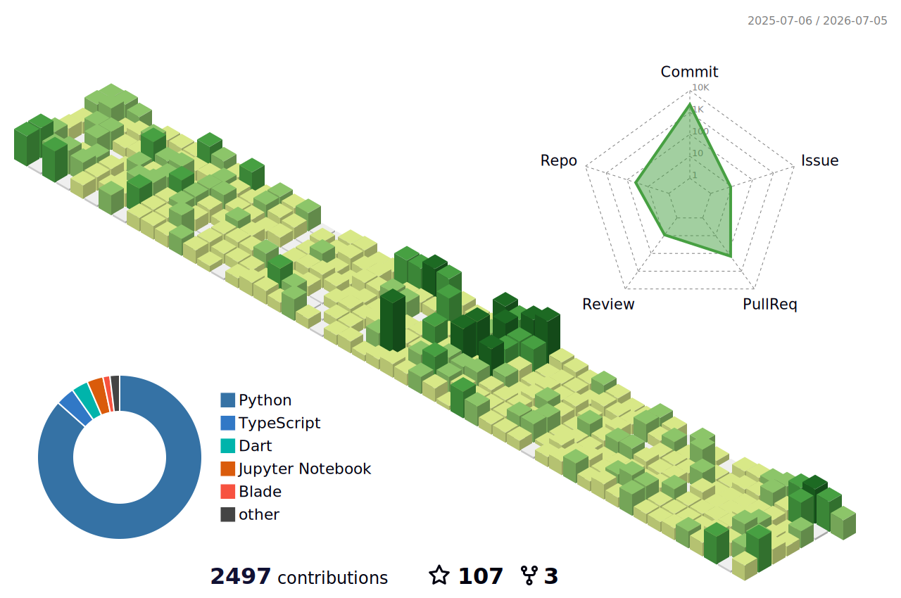

<!-- ═══════════════════════════════════════════════════════════════════════
     🖤💚 DARK HACKER GREEN — Top 1% GitHub Profile
     Theme: Matrix-inspired | #0d1117 background | #00ff41 accents
     ═══════════════════════════════════════════════════════════════════════ -->

<!-- HEADER: Dark-to-Green Gradient Wave -->
<div align="center">
  

  <a href="https://git.io/typing-svg">
    
  </a>
</div>

<!-- SOCIAL LINKS -->
<div align="center">
  <a href="https://game-ldev.vercel.app/">
    
  </a>
  <a href="https://linkedin.com/in/gemechu-alemu-9a5185338">
    
  </a>
  <a href="mailto:alemugemechu44@gmail.com">
    
  </a>
  <a href="https://leetcode.com/game_ale/">
    
  </a>
  <a href="https://codeforces.com/profile/gemechualemu">
    
  </a>
  <a href="https://t.me/AletheiaNike">
    
  </a>
  <a href="https://x.com/alemu_geme88545">
    
  </a>
  <a href="https://zindi.africa/users/game_ale">
    
  </a>
</div>

<br/>

<!-- GITHUB TROPHIES -->
<div align="center">
  
  
  
  
  
</div>

<br/>

<!-- SNAKE ANIMATION -->
<h3 align="center">🐍 Contribution Journey</h3>

<div align="center">
  <picture>
    <source media="(prefers-color-scheme: dark)" srcset="https://raw.githubusercontent.com/game-ale/game-ale/output/github-contribution-grid-snake-dark.svg" />
    <source media="(prefers-color-scheme: light)" srcset="https://raw.githubusercontent.com/game-ale/game-ale/output/github-contribution-grid-snake.svg" />
    
  </picture>
</div>

<br/>

---

<!-- ABOUT SECTION -->
<h3 align="center">👨‍💻 Engineering Intelligence</h3>

<div align="center">

```
🇪🇹  TOP CONTRIBUTOR IN ETHIOPIA  🇪🇹
```

</div>

<p align="center">
  I am a fourth-year <strong>CSE Student at ASTU</strong> operating at the intersection of <strong>AI/ML Engineering</strong>, <strong>Mobile Development</strong>, and <strong>Competitive Programming</strong>. Trained through <strong>A2SV (Africa to Silicon Valley — backed by Google)</strong>, I build production-grade intelligence platforms — RAG pipelines, ML systems, and scalable Flutter applications.
</p>

<p align="center">
  <em>"I build systems that are efficient by design and intelligent by default."</em>
</p>

---

<!-- ACHIEVEMENTS -->
<h3 align="center">🏅 Key Achievements</h3>

<div align="center">
  <table>
    <tr>
      <td align="center">🥇</td>
      <td><strong>ICPC 2025 — ETCPC</strong></td>
      <td>8th Place nationally in Ethiopia</td>
    </tr>
    <tr>
      <td align="center">🥈</td>
      <td><strong>CSEC CPD Cup</strong></td>
      <td>2nd Place among 27 competing teams</td>
    </tr>
    <tr>
      <td align="center">🏆</td>
      <td><strong>ALX Code League</strong></td>
      <td>6th Place nationally — representing ASTU</td>
    </tr>
    <tr>
      <td align="center">🧠</td>
      <td><strong>LeetCode</strong></td>
      <td>775+ Problems Solved · Rating 1416+</td>
    </tr>
    <tr>
      <td align="center">⚔️</td>
      <td><strong>Codeforces</strong></td>
      <td>Rating 1081 · Active Competitor</td>
    </tr>
    <tr>
      <td align="center">🤖</td>
      <td><strong>Zindi Africa</strong></td>
      <td>Top 10% in multiple ML competitions</td>
    </tr>
    <tr>
      <td align="center">🎓</td>
      <td><strong>10 Academy — Kifiya AI</strong></td>
      <td>Certified AI & MLOps Engineer</td>
    </tr>
    <tr>
      <td align="center">💼</td>
      <td><strong>A2SV (Google-Backed)</strong></td>
      <td>Software Engineering Trainee · 450+ problems</td>
    </tr>
  </table>
</div>

---

<!-- TECH STACK -->
<h3 align="center">🚀 Technical Arsenal</h3>

<div align="center">
  <br/>
  <br/>
  
</div>

---

<!-- COMPETITIVE PROGRAMMING SECTION -->
<h3 align="center">🏆 Algorithmic Mastery</h3>

<div align="center">
  <table>
    <tr>
      <td align="center" width="50%">
        <a href="https://leetcode.com/game_ale/">
          
        </a>
      </td>
      <td align="center" width="50%">
        <h3>🥇 ICPC 2025 (Ethiopia)</h3>
        <p><code>8th Place Regional Rank</code></p>
        <p>Awarded for excellence in algorithmic problem solving under high pressure.</p>
        <br/>
        <strong>⚔️ Codeforces:</strong> Rating 1081<br/>
        <strong>🎓 LeetCode:</strong> 775+ Problems Solved<br/>
        <strong>🏅 Rating:</strong> 1416+
      </td>
    </tr>
  </table>
</div>

---

<!-- GITHUB STATS SECTION — Hacker Green Theme -->
<h3 align="center">📊 GitHub Analytics</h3>

<div align="center">
  
  
  
  
  <br/>
  
  
</div>

---

<!-- ACTIVITY GRAPH -->
<h3 align="center">📈 Contribution Activity</h3>

<div align="center">
  
</div>

---

<!-- 3D CONTRIBUTION GRAPH -->
<h3 align="center">🧊 3D Contribution Map</h3>

<div align="center">
  <picture>
    <source media="(prefers-color-scheme: dark)" srcset="./profile-3d-contrib/profile-night-green.svg" />
    
  </picture>
</div>

---

<!-- SPOTIFY NOW PLAYING -->
<h3 align="center">🎵 Vibing While Coding</h3>

<div align="center">
  
  <a href="https://github.com/kittinan/spotify-github-profile">
    
  </a>
</div>

---

<!-- FOOTER -->
<div align="center">
  
</div>

<br/>

<div align="center">
  
</div>
